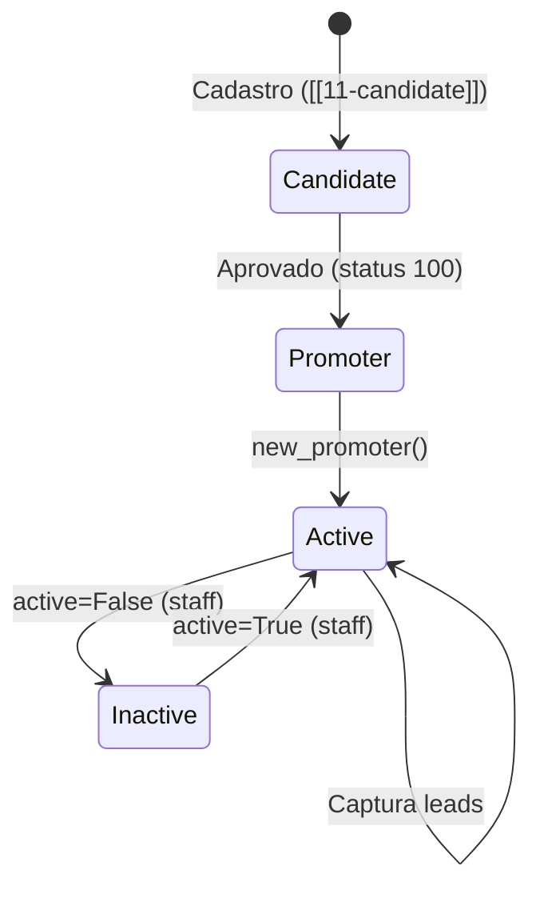

---
tags:
  - supletico
  - promoter
aliases:
  - Promoter
created: 2026-04-29
status: especificação
---

# 10 — Promoter

Vendedor ativo. Nasce quando um [[11-candidate|candidate]] é aprovado. A partir daí, captura leads, acompanha status, e recebe comissões via [[08-finance]].

> [!info] Conexões
> - [[11-candidate]] — nasce via `candidate.tools.approve` (status 100)
> - [[06-lead]] — seus leads; API do promoter consulta `lead.tools.*`
> - [[05-data]] — perfis dos leads consultados via `data.tools.*`
> - [[09-hub]] — pertence a um hub; FK `hub.Hub`
> - [[08-finance]] — comissões de captação e conclusão
> - [[04-auth]] — role `promoter`, mudança de role vinda do candidate
> - [[01-config-e-env]] — `DEFAULT_PROMOTER`, `FRONTEND_URL_LOGIN_PROMOTER`

**Regra fundamental:** o app promoter **NÃO** consulta models de outros apps diretamente. Toda leitura de leads e profiles passa por `lead.tools.*` e `data.tools.*`. O promoter só expõe endpoints que o frontend do vendedor consome.

---

## Estrutura

```text
promoter/
├── models/
│   ├── __init__.py
│   └── promoter.py
├── api/
│   ├── __init__.py
│   ├── schemas.py
│   ├── authenticated.py     # GET /promoter (dados próprios)
│   ├── leads.py             # GET /leads, /leads/{status}, /leads/{external_id}
│   └── profiles.py          # GET /profiles (perfis dos leads)
├── tools/
│   ├── __init__.py
│   └── new_promoter.py      # chamado por candidate.tools.approve
├── notify/
│   └── new_lead_to_promotor.md
└── apps.py
```

> [!info] Estrutura enxuta
> O promoter não tem `services/`, `validators/`, `normalizers/` ou `signals/` — sua lógica de negócio é delegada a [[06-lead|lead]] e [[05-data|data]]. O promoter é essencialmente uma **camada de API** com um model simples de vínculo.

---

## 10.1 Models

### `promoter/models/promoter.py`

```python
from django.db import models
from core.models.base import BaseModel, ExternalIdMixin

class Promoter(BaseModel, ExternalIdMixin):
    profile = models.OneToOneField(
        "data.Profile",
        on_delete=models.CASCADE,
        related_name="promoter",
    )
    hub = models.ForeignKey(
        "hub.Hub",
        on_delete=models.PROTECT,
        related_name="promoters",
    )
    active = models.BooleanField(default=True)

    class Meta:
        constraints = [
            models.UniqueConstraint(
                fields=["profile"],
                name="unique_promoter_profile",
            )
        ]
```

`profile` é OneToOneField — cada Profile só pode ter um Promoter.  
`hub` é FK — todo promoter pertence a um hub, herdado do [[11-candidate|candidate]] aprovado.  
`active` permite desativar um promoter sem deletar (ex: inatividade ou violação de regras).

**Relação:** promoter **sempre** pertence a um hub. Sem hub, não existe promoter.

---

## 10.2 Schemas

```python
# promoter/api/schemas.py
from ninja import Schema
from typing import Optional

class PromoterOut(Schema):
    external_id: str
    hub_external_id: str
    hub_name: str
    active: bool
    first_name: Optional[str] = None
    cpf: str

class LeadSummaryOut(Schema):
    """Resumo de lead retornado ao promoter (visão limitada)."""
    external_id: str
    first_name: Optional[str]
    cpf: str
    status: int
    created_at: str

class LeadDetailOut(LeadSummaryOut):
    """Detalhe de lead — inclui endereço quando disponível."""
    email: Optional[str] = None
    address_rua: Optional[str] = None
    address_cidade: Optional[str] = None
    address_estado: Optional[str] = None

class ProfileSummaryOut(Schema):
    """Perfil do lead visível ao promoter."""
    external_id: str
    first_name: Optional[str]
    cpf: str
    lead_status: int
    lead_created_at: str

class NewPromoterIn(Schema):
    """Usado internamente por candidate.tools.approve — não é endpoint REST."""
    profile_external_id: str
    hub_external_id: str
```

---

## 10.3 API

### `promoter/api/authenticated.py`

Endpoint para o promoter ver os próprios dados.

```python
from ninja import Router
from core.auth_helpers.role_required import require_role
from .schemas import PromoterOut

router = Router(tags=["promoter"])

@router.get("/promoter", response=PromoterOut, auth=JWTAuth())
def get_my_promoter(request, _: None = Depends(require_role("promoter"))):
    """Retorna dados do promoter logado."""
    promoter = request.user.profile.promoter
    return PromoterOut(
        external_id=str(promoter.external_id),
        hub_external_id=str(promoter.hub.external_id),
        hub_name=promoter.hub.name,
        active=promoter.active,
        first_name=request.user.first_name,
        cpf=request.user.profile.cpf,
    )
```

---

### `promoter/api/leads.py`

Lista de leads capturados pelo promoter. **NÃO consulta `Lead` diretamente** — chama `lead.tools.*`.

```python
from ninja import Router
from core.auth_helpers.role_required import require_role
from .schemas import LeadSummaryOut, LeadDetailOut

router = Router(tags=["promoter-leads"])

@router.get("/leads", response=list[LeadSummaryOut], auth=JWTAuth())
def list_my_leads(request, _: None = Depends(require_role("promoter"))):
    """Todos os leads capturados por este promoter."""
    from lead.tools.list_by_promoter import list_by_promoter

    promoter = request.user.profile.promoter
    results = list_by_promoter(promoter=promoter)
    return [
        LeadSummaryOut(
            external_id=r["external_id"],
            first_name=r.get("first_name"),
            cpf=r["cpf"],
            status=r["status"],
            created_at=r["created_at"],
        )
        for r in results
    ]


@router.get("/leads/{status}", response=list[LeadSummaryOut], auth=JWTAuth())
def list_my_leads_by_status(
    request, status: int, _: None = Depends(require_role("promoter"))
):
    """Leads do promoter filtrados por status."""
    from lead.tools.list_by_promoter import list_by_promoter

    promoter = request.user.profile.promoter
    results = list_by_promoter(promoter=promoter, status=status)
    return [
        LeadSummaryOut(
            external_id=r["external_id"],
            first_name=r.get("first_name"),
            cpf=r["cpf"],
            status=r["status"],
            created_at=r["created_at"],
        )
        for r in results
    ]


@router.get("/leads/by-id/{external_id}", response=LeadDetailOut, auth=JWTAuth())
def get_my_lead(
    request, external_id: str, _: None = Depends(require_role("promoter"))
):
    """Detalhe de um lead específico (se pertencer a este promoter)."""
    from lead.tools.get_by_id import get_by_id

    promoter = request.user.profile.promoter
    result = get_by_id(external_id=external_id, promoter=promoter)
    return LeadDetailOut(
        external_id=result["external_id"],
        first_name=result.get("first_name"),
        cpf=result["cpf"],
        status=result["status"],
        created_at=result["created_at"],
        email=result.get("email"),
        address_rua=result.get("address_rua"),
        address_cidade=result.get("address_cidade"),
        address_estado=result.get("address_estado"),
    )
```

---

### `promoter/api/profiles.py`

Perfis dos leads do promoter. **NÃO consulta `Profile` diretamente** — chama `data.tools.*`.

```python
from ninja import Router
from core.auth_helpers.role_required import require_role
from .schemas import ProfileSummaryOut

router = Router(tags=["promoter-profiles"])

@router.get("/profiles", response=list[ProfileSummaryOut], auth=JWTAuth())
def list_my_profiles(request, _: None = Depends(require_role("promoter"))):
    """Perfis dos leads capturados por este promoter."""
    from data.tools.list_profiles_by_promoter import list_profiles_by_promoter

    promoter = request.user.profile.promoter
    results = list_profiles_by_promoter(promoter=promoter)
    return [
        ProfileSummaryOut(
            external_id=r["external_id"],
            first_name=r.get("first_name"),
            cpf=r["cpf"],
            lead_status=r["lead_status"],
            lead_created_at=r["lead_created_at"],
        )
        for r in results
    ]
```

---

## 10.4 Tools

### `promoter/tools/new_promoter.py`

Única tool exposta pelo promoter para outros apps. Chamada por [[11-candidate|candidate.tools.approve]] quando o candidate é aprovado (status 100).

```python
from django.db import transaction
from promoter.models import Promoter


@transaction.atomic
def new_promoter(profile, hub) -> Promoter:
    """
    Cria um Promoter vinculado ao Profile e Hub.

    Chamado por:
        candidate.tools.approve.approve_candidate()
        (quando candidate vira status 100)

    Args:
        profile: instância de data.models.Profile
        hub: instância de hub.models.Hub

    Returns:
        Promoter criado (active=True por padrão)
    """
    promoter = Promoter.objects.create(
        profile=profile,
        hub=hub,
        active=True,
    )
    return promoter
```

> [!info] Quem chama `new_promoter`
> `[[11-candidate|candidate.tools.approve]]` → `new_promoter(profile=candidate.profile, hub=candidate.hub)`.  
> O promoter **nunca** é criado por endpoint REST direto. Sempre nasce da aprovação de um candidate.

---

## 10.5 Tools necessárias em outros apps

O promoter depende de tools que **não existem ainda** nos apps [[06-lead|lead]] e [[05-data|data]]. Elas precisam ser criadas nesses apps (seguindo a regra: quem mexe no model é o app dono).

> [!warning] Tools a criar
> Estas funções ainda não foram especificadas nos documentos dos apps de origem. Precisam ser adicionadas em `06-lead.md` (seção 6.4) e `05-data.md` (seção 5.2).

### `lead/tools/list_by_promoter.py`

```python
def list_by_promoter(promoter, status: int | None = None) -> list[dict]:
    """
    Lista leads de um promoter, opcionalmente filtrados por status.

    Args:
        promoter: instância de promoter.models.Promoter
        status: filtro opcional de status (Lead.STATUS_*)

    Returns:
        Lista de dicts com {external_id, first_name, cpf, status, created_at}
    """
    from lead.models import Lead

    qs = Lead.objects.filter(promoter=promoter.profile).select_related(
        "profile__user"
    )
    if status is not None:
        qs = qs.filter(status=status)

    return [
        {
            "external_id": str(lead.profile.external_id),
            "first_name": lead.profile.user.first_name or None,
            "cpf": lead.profile.cpf,
            "status": lead.status,
            "created_at": lead.created_at.isoformat(),
        }
        for lead in qs.order_by("-created_at")
    ]
```

### `lead/tools/get_by_id.py`

```python
from django.core.exceptions import ObjectDoesNotExist


def get_by_id(external_id: str, promoter) -> dict:
    """
    Retorna detalhe de um lead específico do promoter.

    Args:
        external_id: external_id do Profile do lead
        promoter: instância de promoter.models.Promoter

    Returns:
        Dict com campos do lead + endereço (se disponível)

    Raises:
        ObjectDoesNotExist: se não encontrar ou não pertencer ao promoter
    """
    from lead.models import Lead

    lead = Lead.objects.select_related(
        "profile__user", "profile__address"
    ).get(
        profile__external_id=external_id,
        promoter=promoter.profile,
    )

    addr = lead.profile.address
    return {
        "external_id": str(lead.profile.external_id),
        "first_name": lead.profile.user.first_name or None,
        "cpf": lead.profile.cpf,
        "status": lead.status,
        "created_at": lead.created_at.isoformat(),
        "email": lead.profile.user.email or None,
        "address_rua": addr.rua if addr else None,
        "address_cidade": addr.cidade if addr else None,
        "address_estado": addr.estado if addr else None,
    }
```

### `data/tools/list_profiles_by_promoter.py`

```python
def list_profiles_by_promoter(promoter) -> list[dict]:
    """
    Lista perfis dos leads capturados por um promoter.

    Args:
        promoter: instância de promoter.models.Promoter

    Returns:
        Lista de dicts com {external_id, first_name, cpf, lead_status, lead_created_at}
    """
    from lead.models import Lead

    leads = Lead.objects.filter(
        promoter=promoter.profile
    ).select_related("profile__user").order_by("-created_at")

    return [
        {
            "external_id": str(lead.profile.external_id),
            "first_name": lead.profile.user.first_name or None,
            "cpf": lead.profile.cpf,
            "lead_status": lead.status,
            "lead_created_at": lead.created_at.isoformat(),
        }
        for lead in leads
    ]
```

> [!info] `data.tools.list_profiles_by_promoter` consulta `Lead`
> Essa tool está em `data` mas consulta `lead.models.Lead` — isso é aceitável porque `data` é um app de fundação (abaixo de `lead` na hierarquia). Se preferir isolamento total, mover para `lead.tools` e renomear. A decisão fica para `[[13-pendencias-e-decisoes]]`.

---

## 10.6 Notify templates

### `promoter/notify/new_lead_to_promotor.md`

Template enviado ao promoter quando alguém se cadastra usando seu link de indicação. Disparado por `[[06-lead|lead/api/public.py]]` no `register`.

```text
Novo lead capturado! 🔔

CPF: {{ lead_cpf }}
ID: {{ lead_external_id }}

Acompanhe o progresso na sua área de promoter.
```

> [!info] Disparo
> O notify é enviado em `[[06-lead|lead/api/public.py → register]]`, junto com o notify de boas-vindas ao lead. O promoter recebe CPF e external_id para acompanhamento.

---

## 10.7 Variáveis de config usadas

| Variável | Uso |
| :---- | :---- |
| `DEFAULT_PROMOTER` | [[06-lead|lead/normalizers/promoter.py]] — promoter fallback quando lead chega sem referência |
| `FRONTEND_URL_LOGIN_PROMOTER` | Redirect após aprovação do candidate ([[11-candidate]]) + login do promoter |

---

## 10.8 Comissões

O promoter recebe dois tipos de comissão, ambas gerenciadas por [[08-finance]]:

1. **Comissão de captação** — quando um lead paga a taxa de matrícula (status 100).  
   Disparado em `[[06-lead|lead.tools.update_status]]` → `finance.tools.new_commission_promotor`.

2. **Comissão de conclusão** — quando o aluno conclui o supletivo.  
   Disparado em `[[07-enrollment|enrollment.tools.*]]` → `finance.tools.new_commission_promotor`.

O promoter **não** gerencia comissões diretamente. Apenas visualiza via endpoints de [[08-finance|finance]].

---

## 10.9 Ciclo de vida



1. Candidate é aprovado → `candidate.tools.approve` chama `promoter.tools.new_promoter`
2. Promoter nasce `active=True`, vinculado ao hub do candidate
3. Promoter captura leads via link de indicação (ou `DEFAULT_PROMOTER` como fallback)
4. Staff pode desativar/reativar via `active` (endpoint staff a definir em [[12-staff]])

---

## 10.10 Pontos abertos

> [!warning] Pontos abertos relacionados
> - ⚠️ **Tools `list_by_promoter` e `get_by_id`** ainda não existem em [[06-lead|lead/tools/]]. Precisam ser criadas (ver seção 10.5 acima).
> - ⚠️ **`data.tools.list_profiles_by_promoter`** — fica em `data` mas consulta `Lead`. Avaliar se deve migrar para `lead.tools` em [[13-pendencias-e-decisoes]].
> - ⚠️ **Desativação de promoter** — staff precisa de endpoint para alternar `active`. Definir em [[12-staff]].
> - ⚠️ **Múltiplos promoters por Profile?** Não — `OneToOneField` garante unicidade. Se um promoter for desativado e depois reativado, é o mesmo registro.
> - ⚠️ **Promoter pode trocar de hub?** Com a modelagem atual (`on_delete=PROTECT`), não sem intervenção. Se necessário, staff pode alterar via endpoint admin.
> - ⚠️ **Link de indicação** — como o promoter recebe e compartilha seu link? Precisa de endpoint `GET /promoter/link` que retorna URL com `promoter=<external_id>`. Definir junto com o frontend.
