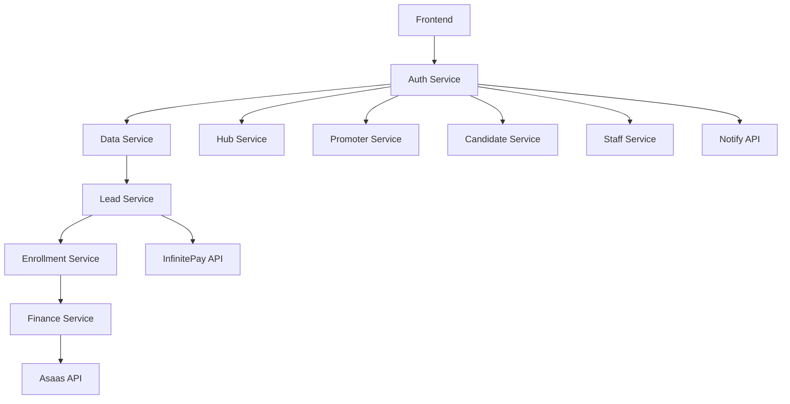
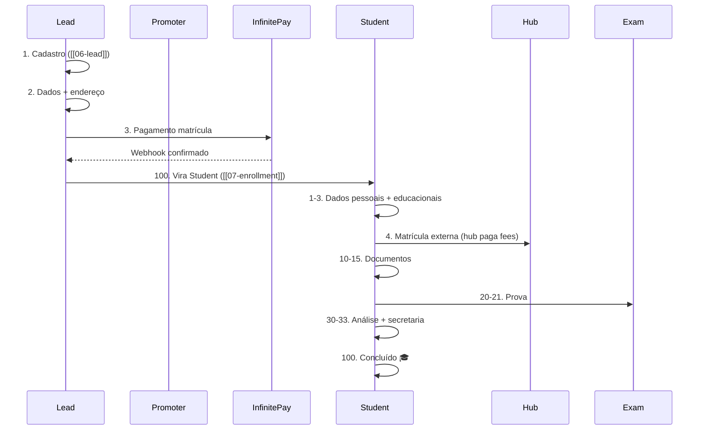
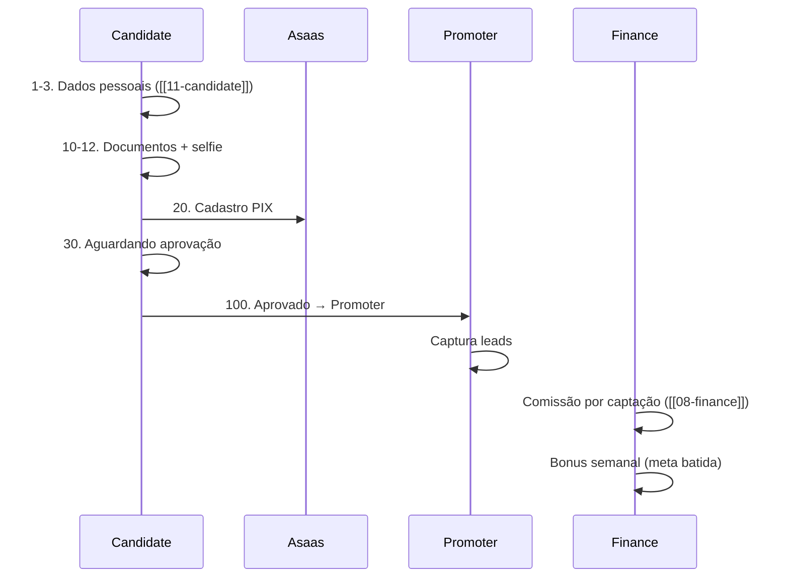
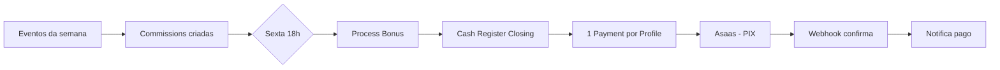

---
tags:
  - supletico
  - moc
  - arquitetura
  - fastapi
created: 2026-04-29
status: especificação
---

# Supletivo.net — MOC

> [!abstract] Stack alvo
> **FastAPI** microserviços + **PostgreSQL** + **Redis** + **Celery**
> 
> A especificação original foi escrita em sintaxe Django. A implementação real será em **FastAPI** com serviços independentes, seguindo o mesmo padrão dos serviços já existentes ([[02-integracoes-externas|Notify, Asaas, InfinitePay]]).

---

## Estrutura do sistema

---

## Apps / Módulos

| # | Módulo | Documento | Responsabilidade |
|:--|:-------|:----------|:-----------------|
| 00 | Arquitetura | [[00-arquitetura-geral]] | Visão geral, stack, princípios |
| 01 | Config | [[01-config-e-env]] | `.env`, `config.py`, SystemConfig |
| 02 | Integrações | [[02-integracoes-externas]] | Notify, Asaas, InfinitePay |
| 03 | Core | [[03-core]] | BaseModel, clients, validators, helpers |
| 04 | Auth | [[04-auth]] | OTP, JWT, roles, register/check polimórfico |
| 05 | Data | [[05-data]] | Profile, Address, Educational, documentos |
| 06 | Lead | [[06-lead]] | Pré-matrícula (status 1→2→3→100) |
| 07 | Enrollment | [[07-enrollment]] | Aluno/matrícula (15 status) |
| 08 | Finance | [[08-finance]] | Comissões, pagamentos, friday closing |
| 09 | Hub | *pendente* | Polo físico |
| 10 | Promoter | *pendente* | Vendedor ativo |
| 11 | Candidate | [[11-candidate]] | Pipeline promoter (10 status) |
| 12 | Staff | *pendente* | Admin, config runtime, logs |
| 13 | Pendências | *pendente* | Decisões em aberto |

---

## Fluxos principais

### Jornada do aluno

### Jornada do promoter

### Fluxo financeiro semanal

---

## Conceitos transversais

- **[[00-arquitetura-geral#external-id|external_id]]** — UUID v4 imutável, chave pública para tudo
- **[[00-arquitetura-geral#roles-disponiveis|Roles]]** — lead, student, candidate, promoter, hub_coordinator, staff
- **[[01-config-e-env#filosofia|Config]]** — `config.X` como interface única, `.env` como fonte
- **[[00-arquitetura-geral#convencao-tools-vs-services|tools vs services]]** — `tools/` público, `services/` privado
- **[[00-arquitetura-geral#estrutura-padrao-de-api-django-ninja|API por role]]** — `public.py`, `authenticated.py`, `by_role/`
- **[[00-arquitetura-geral#convencao-de-nomes-de-arquivos-md-de-notify|Notificações declarativas]]** — `.md` com Jinja + diretivas `--tts`, `--media`

---

## Status dos subsistemas

| Serviço | IP | Status | Doc |
|:--------|:---|:------|:----|
| Notify | `10.10.10.119:8000` | ✅ Em produção | [[02-integracoes-externas#notify]] |
| InfinitePay | `10.10.10.120:8000` | ✅ Em produção | [[02-integracoes-externas#infinitepay]] |
| Asaas | `10.10.10.121` | ✅ Em produção | [[02-integracoes-externas#asaas]] |
| Auth | `10.10.10.122` | 🔨 Especificado | [[04-auth]] |
| Data | — | 🔨 Especificado | [[05-data]] |
| Lead | — | 🔨 Especificado | [[06-lead]] |
| Enrollment | — | 🔨 Especificado | [[07-enrollment]] |
| Finance | — | 🔨 Especificado | [[08-finance]] |
| Candidate | — | 🔨 Especificado | [[11-candidate]] |
| Hub | — | ❌ Pendente | — |
| Promoter | — | ❌ Pendente | — |
| Staff | — | ❌ Pendente | — |
